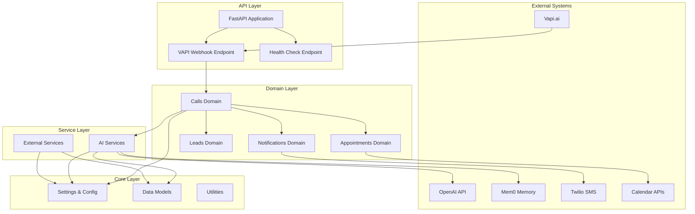
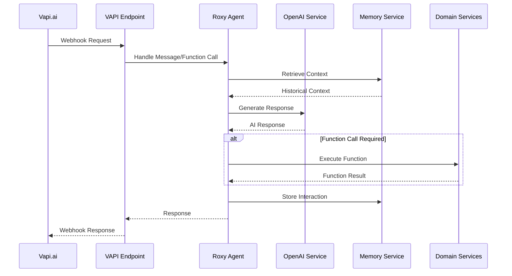
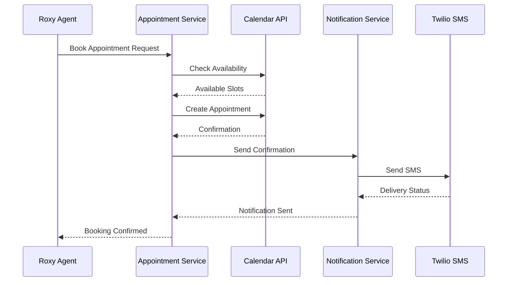

# VoiceHive Module Relationships

## Overview
This document describes the relationships and dependencies between modules in the VoiceHive backend system.

## High-Level Architecture



## Module Dependencies

### API Layer Dependencies
```
voicehive.api.v1.endpoints.vapi
├── voicehive.models.vapi
├── voicehive.domains.calls.services.roxy_agent
└── voicehive.utils.exceptions

voicehive.api.v1.api
└── voicehive.api.v1.endpoints.vapi

voicehive.main
├── voicehive.api.v1.api
├── voicehive.core.settings
└── voicehive.utils.exceptions
```

### Domain Layer Dependencies
```
voicehive.domains.calls.services.roxy_agent
├── voicehive.core.settings
├── voicehive.models.vapi
├── voicehive.services.ai.openai_service
├── voicehive.domains.appointments.services.appointment_service
├── voicehive.domains.leads.services.lead_service
├── voicehive.domains.notifications.services.notification_service
└── voicehive.utils.exceptions

voicehive.domains.appointments.services.appointment_service
├── voicehive.models.vapi
├── voicehive.services.external.calendar_service
└── voicehive.utils.exceptions

voicehive.domains.leads.services.lead_service
├── voicehive.models.vapi
├── voicehive.services.external.crm_service
└── voicehive.utils.exceptions

voicehive.domains.notifications.services.notification_service
├── voicehive.models.vapi
├── voicehive.services.external.twilio_service
├── voicehive.services.external.email_service
└── voicehive.utils.exceptions
```

### Service Layer Dependencies
```
voicehive.services.ai.openai_service
├── voicehive.core.settings
├── voicehive.models.vapi
├── voicehive.utils.retry
└── voicehive.utils.exceptions

voicehive.services.ai.memory_service
├── voicehive.core.settings
├── voicehive.models.memory
└── voicehive.utils.exceptions

voicehive.services.external.twilio_service
├── voicehive.core.settings
└── voicehive.utils.exceptions
```

## Data Flow Diagrams

### Call Handling Flow


### Appointment Booking Flow


## Dependency Rules

### Layer Dependencies
1. **API Layer** can depend on Domain and Core layers
2. **Domain Layer** can depend on Service and Core layers
3. **Service Layer** can depend on Core layer only
4. **Core Layer** has no internal dependencies

### Cross-Domain Dependencies
1. Domains can communicate through well-defined interfaces
2. No direct database access from domains (future consideration)
3. Shared models are in the models package
4. Utilities are shared across all layers

### External Dependencies
1. All external service calls go through Service Layer
2. API keys and configuration managed in Core Layer
3. Retry logic and error handling in Utils Layer

## Testing Strategy by Module

### Unit Testing
- **Core Layer**: Configuration validation, utility functions
- **Service Layer**: Mock external APIs, test business logic
- **Domain Layer**: Test domain rules and workflows
- **API Layer**: Test request/response handling

### Integration Testing
- **API Endpoints**: Full request/response cycle
- **External Services**: Test with real APIs (staging)
- **Cross-Domain**: Test domain interactions

### Performance Testing
- **API Response Times**: < 200ms for simple requests
- **Memory Usage**: Monitor conversation history growth
- **External API Latency**: Track and alert on degradation

## Monitoring Points

### Health Checks
- Database connectivity (future)
- External API availability
- Memory service status
- Configuration validation

### Metrics
- Request/response times by endpoint
- Function call success rates
- Memory usage per conversation
- External API error rates

### Logging
- Structured logging with correlation IDs
- Request/response logging
- Error tracking with stack traces
- Performance metrics logging
