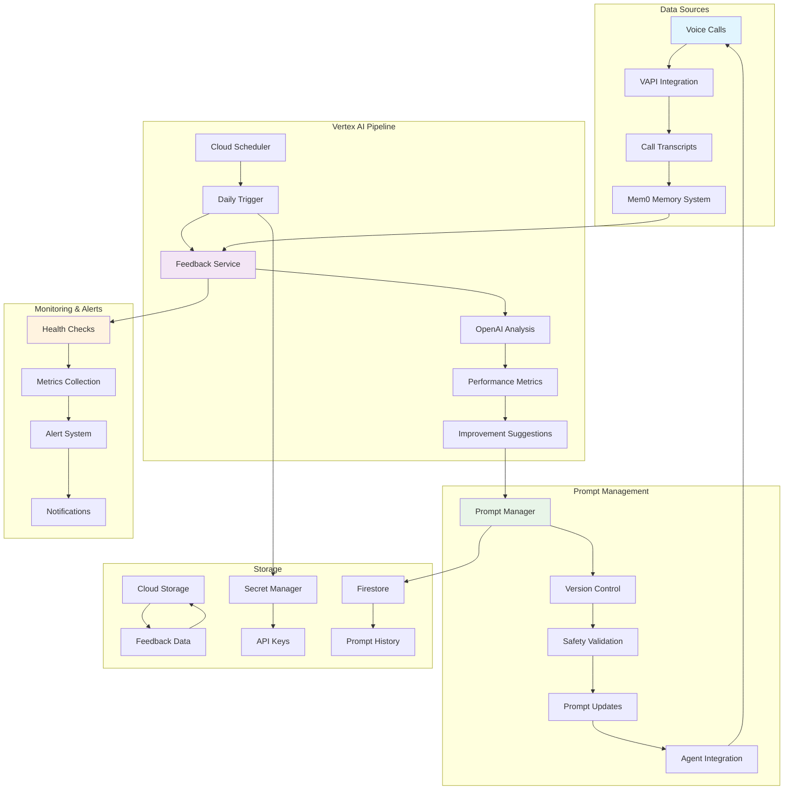
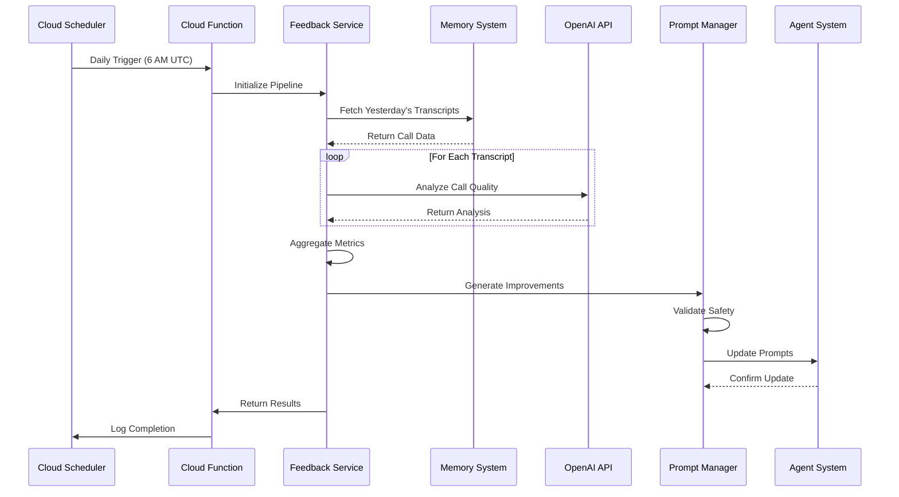
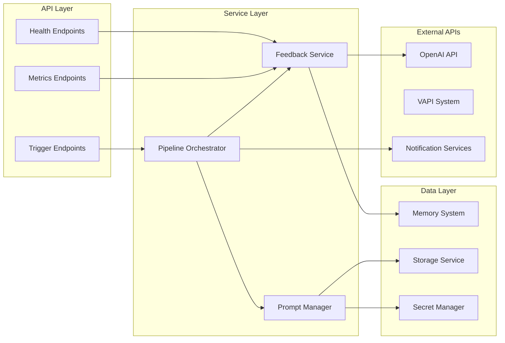

# VoiceHive Vertex AI Feedback System Architecture

## Overview

The VoiceHive Vertex AI Feedback System is a comprehensive solution for automatically analyzing voice call transcripts and continuously improving AI agent prompts based on real conversation data.

## Architecture Diagram



## Component Architecture

### 1. Data Flow Architecture



### 2. Service Layer Architecture



## Key Components

### 1. Vertex Feedback Service
- **Purpose**: Core analysis engine for call transcripts
- **Technology**: Python, OpenAI API, Google Cloud
- **Responsibilities**:
  - Transcript analysis and sentiment scoring
  - Performance metrics calculation
  - Issue identification and categorization
  - Improvement suggestion generation

### 2. Daily Feedback Pipeline
- **Purpose**: Orchestrates the complete feedback loop
- **Technology**: Cloud Functions, Cloud Scheduler
- **Responsibilities**:
  - Scheduled execution management
  - Error handling and retry logic
  - Result aggregation and storage
  - Notification dispatch

### 3. Prompt Manager
- **Purpose**: Manages prompt versioning and updates
- **Technology**: Python, Firestore, Git integration
- **Responsibilities**:
  - Version control for prompts
  - Safety validation of changes
  - Rollback capabilities
  - Change tracking and audit logs

### 4. Memory Integration
- **Purpose**: Interfaces with Mem0 for transcript storage
- **Technology**: Mem0 API, Cloud Storage
- **Responsibilities**:
  - Transcript retrieval and filtering
  - Data preprocessing and cleaning
  - Metadata extraction and tagging

## Data Models

### Feedback Summary
```python
@dataclass
class FeedbackSummary:
    date: str
    total_calls_analyzed: int
    performance_metrics: Dict[str, float]
    common_issues: List[Dict[str, Any]]
    improvement_suggestions: List[Dict[str, Any]]
    recommended_prompt_changes: List[Dict[str, Any]]
```

### Prompt Version
```python
@dataclass
class PromptVersion:
    version: str
    timestamp: str
    prompt: Dict[str, str]
    rationale: str
    performance_metrics: Dict[str, float]
    status: str  # active, inactive, pending, rollback
```

## Security Architecture

### 1. Authentication & Authorization
- Service account-based authentication
- IAM roles with least privilege principle
- Secret Manager for credential storage
- API key rotation policies

### 2. Data Protection
- Encryption at rest and in transit
- PII data handling compliance
- Audit logging for all operations
- Data retention policies

### 3. Network Security
- VPC-native deployments
- Private service connections
- Firewall rules and security groups
- SSL/TLS termination

## Scalability Considerations

### 1. Horizontal Scaling
- Stateless service design
- Load balancing across instances
- Auto-scaling based on demand
- Queue-based processing for high volume

### 2. Performance Optimization
- Caching strategies for frequent queries
- Batch processing for efficiency
- Asynchronous operations
- Connection pooling

### 3. Resource Management
- Memory and CPU optimization
- Storage lifecycle management
- Cost optimization strategies
- Resource quotas and limits

## Monitoring & Observability

### 1. Metrics Collection
- System performance metrics
- Business logic metrics
- Error rates and latencies
- Resource utilization

### 2. Logging Strategy
- Structured logging with JSON format
- Log aggregation and centralization
- Log retention and archival
- Security and audit logs

### 3. Alerting System
- Real-time alert generation
- Escalation policies
- Integration with notification systems
- Alert fatigue prevention

## Deployment Architecture

### 1. Environment Strategy
- Development, staging, production environments
- Infrastructure as Code (IaC)
- Automated deployment pipelines
- Blue-green deployment strategy

### 2. Configuration Management
- Environment-specific configurations
- Feature flags and toggles
- Dynamic configuration updates
- Configuration validation

### 3. Disaster Recovery
- Backup and restore procedures
- Multi-region deployment
- Failover mechanisms
- Recovery time objectives (RTO)

## Integration Points

### 1. External Systems
- VAPI for voice call integration
- Mem0 for memory management
- OpenAI for AI analysis
- Notification services (Slack, email)

### 2. Internal Systems
- Agent prompt system
- Monitoring dashboards
- Analytics platforms
- Audit and compliance systems

## Future Enhancements

### 1. Advanced Analytics
- Machine learning model integration
- Predictive analytics capabilities
- Real-time analysis streaming
- Custom model training

### 2. Enhanced Automation
- Self-healing capabilities
- Intelligent scaling decisions
- Automated rollback triggers
- Proactive issue detection

### 3. Extended Integrations
- CRM system integration
- Business intelligence tools
- Customer feedback platforms
- Quality assurance systems
